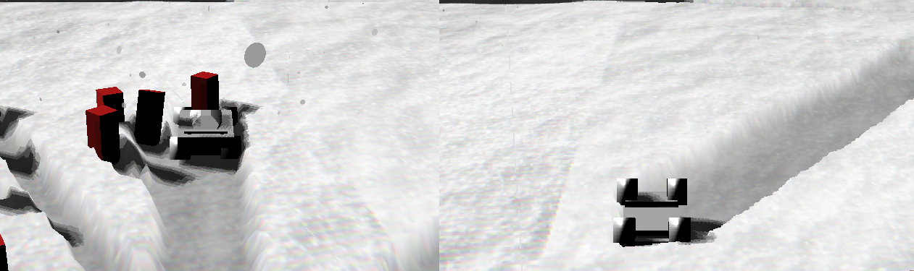
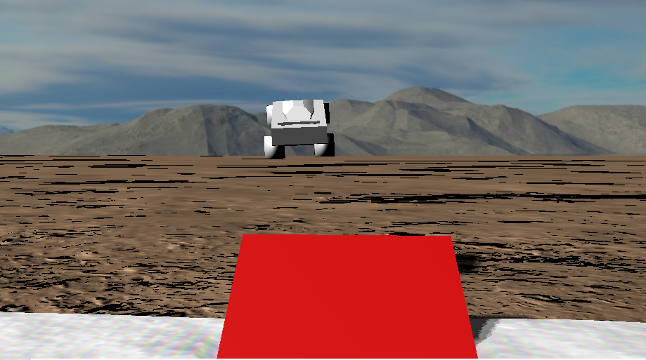
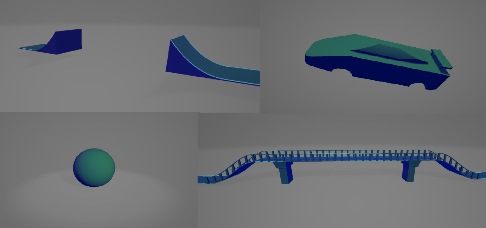

\tableofcontents
\newpage

# Introduction
The aim of this project is to implement an interactive car game with several graphical features.   
The application is developed in C++ because this language provides manual memory control.   
I used the Microsoft Visual Studio compiler to develop the project on Windows 11.   
The source for the project is available at [github.com/colobrodo/car-race](https://github.com/colobrodo/car-race)

## Used Libraries
To implement this project I used the following libraries:   
- **OpenGL** is an API to develop 3D computer graphics application, it provides a way to control and program the rendering pipeline   
- **GLM** a mathematics library that provide extended capabilities like matrix transformations, quaternions, vector math ecc...    
- **Bullet** is a physics engine that simulates collision detection and soft and rigid body dynamics   
- **Assimp**   
- **Dear IMGui** a Immediate mode GUI library to tweak the parameters of the application at runtime.   
- **stb image** a header-only library to load images in memory (used for texturing and normal mapping)   

\newpage

# Project description
## Vehicle
I implemented a vehicle using the `btRaycastVehicle` class provided by Bullet.   
Normally, to model a vehicle in a physics engine, you specify each component of the car (as wheel, suspension, chassis, etc...) as a rigid body with physical properties.    
For example, you might specify a spring for each suspension and an object with a specific restitution for the wheels.   
This technique has the disadvantages of being complex, very difficult to set all the parameters of each rigid body to work well with the others, and more expensive for the physics engine due to the number of objects and constraints.   

A simpler technique used in games is the raycast vehicle.   
In this case, only the chassis is modelled as a rigid body, and the wheels are simulated by a ray that is cast onto the terrain, applying an opposing force to the car.   
This way the physics engine only needs to apply a force where the wheels are attached and resolve the collision with the chassis and the other object.

\begin{figure}[!ht]
\centering
\resizebox{.7\textwidth}{!}{%
\begin{circuitikz}
\tikzstyle{every node}=[font=\LARGE]
\draw [short] (6.75,10.25) .. controls (6,10.25) and (6,10.25) .. (5.25,10.25);
\draw [short] (5.25,10.25) .. controls (5.25,10.75) and (5.25,10.75) .. (5.25,11);
\draw [short] (5.25,11) .. controls (6.5,11.5) and (6.5,11.5) .. (7.5,12);
\draw [short] (7.5,12) .. controls (9.25,12) and (9.25,12) .. (11,12);
\draw [short] (11,12) .. controls (11.5,12) and (11.5,12) .. (12,12);
\draw [short] (12,12) .. controls (12,11.25) and (12,11.25) .. (12,10.5);
\draw [short] (12,10.5) .. controls (12,10.5) and (12,10.5) .. (12,10.25);
\draw [short] (12,10.25) .. controls (11.75,10.25) and (11.75,10.25) .. (11.5,10.25);
\draw [short] (10.25,10.25) .. controls (9,10.25) and (9,10.25) .. (7.75,10.25);
\draw [short] (6.75,10.25) .. controls (9.25,10.25) and (9.25,10.25) .. (11.5,10.25);
\draw [-Stealth, dashed] (6.75,10.25) -- (6.75,9);
\draw [-Stealth, dashed] (11,10.25) -- (11,8.25);
\draw [ -Stealth] (6.75,10.5) -- (6.75,13.25);
\draw [ -Stealth] (11,10.5) -- (11,11.5);
\draw  to[short] (8,8.75);
\draw [short] (8,8.75) .. controls (9.25,8.5) and (9.25,8.5) .. (10.25,8);
\draw [short] (10.25,8) .. controls (12.25,8) and (12.25,8) .. (14.25,8);
\draw [short] (11.5,12) .. controls (11.75,12.25) and (11.75,12.25) .. (11.75,12.25);
\draw [short] (11.75,12.5) .. controls (11.75,12.5) and (11.75,12.5) .. (11.75,12.25);
\draw [short] (11.75,12) .. controls (12,12.25) and (12,12.25) .. (12,12.25);
\draw [short] (12,12.25) .. controls (12.25,12.25) and (12.25,12.25) .. (12.5,12.25);
\draw [short] (11.75,12.5) .. controls (12.25,12.5) and (12.25,12.5) .. (12.5,12.5);
\draw [short] (12.5,12.5) .. controls (12.5,12.5) and (12.5,12.5) .. (12.5,12.25);
\draw [short] (7.75,12) .. controls (8.25,12.25) and (8.25,12.25) .. (8.75,12.5);
\draw [short] (8.75,12.5) .. controls (10,12.5) and (10,12.5) .. (11,12.5);
\draw [short] (11,12.5) .. controls (11.25,12.25) and (11.25,12.25) .. (11.25,12);
\end{circuitikz}
}%
\label{fig:my_label}
\end{figure}
In this figure you can see that a greater force is applied at the point where the ray is closer to the terrain, simulating suspension.   

\newpage

In order: The car colliding with some dynamic obstacles. The vehicle overturned. The vehicle jumping on a ramp.   

## Snow
Among the graphical effects I decided to implement, I chose to simulate snow, which is sensitive to the depth of the object stepping on it.

The snow effect is implemented in two steps:   
First, we create a texture with the height of the snow (heightmap).   
Then we draw a quad and tessellate it, displacing each new vertex by the value in the texture.   

To create the heightmap we use two textures:   
One is used to remember the height of the snow in previous frames and the other contains the depth of the object on the snow in the current frame.   
To render the second texture and know how much the object is sinking into the snow, I render the whole scene in a depth buffer, placing the camera on the ground looking up with an orthogonal projection.
The two textures are then combined in the shader using a min pixel per pixel operation.   

\begin{figure}[!ht]
\centering
\resizebox{.7\textwidth}{!}{%
\begin{circuitikz}
\tikzstyle{every node}=[font=\large]
\draw [short] (6.75,10.25) .. controls (6,10.25) and (6,10.25) .. (5.25,10.25);
\draw [short] (5.25,10.25) .. controls (5.25,10.75) and (5.25,10.75) .. (5.25,11);
\draw [short] (5.25,11) .. controls (6.5,11.5) and (6.5,11.5) .. (7.5,12);
\draw [short] (7.5,12) .. controls (9.25,12) and (9.25,12) .. (11,12);
\draw [short] (11,12) .. controls (11.5,12) and (11.5,12) .. (12,12);
\draw [short] (12,12) .. controls (12,11.25) and (12,11.25) .. (12,10.5);
\draw [short] (12,10.5) .. controls (12,10.5) and (12,10.5) .. (12,10.25);
\draw [short] (12,10.25) .. controls (11.75,10.25) and (11.75,10.25) .. (11.5,10.25);
\draw [short] (10.25,10.25) .. controls (9,10.25) and (9,10.25) .. (7.75,10.25);
\draw [short] (6.75,10.25) .. controls (9.25,10.25) and (9.25,10.25) .. (11.5,10.25);
\draw [short] (11.5,12) .. controls (11.75,12.25) and (11.75,12.25) .. (11.75,12.25);
\draw [short] (11.75,12.5) .. controls (11.75,12.5) and (11.75,12.5) .. (11.75,12.25);
\draw [short] (11.75,12) .. controls (12,12.25) and (12,12.25) .. (12,12.25);
\draw [short] (12,12.25) .. controls (12.25,12.25) and (12.25,12.25) .. (12.5,12.25);
\draw [short] (11.75,12.5) .. controls (12.25,12.5) and (12.25,12.5) .. (12.5,12.5);
\draw [short] (12.5,12.5) .. controls (12.5,12.5) and (12.5,12.5) .. (12.5,12.25);
\draw [short] (7.75,12) .. controls (8.25,12.25) and (8.25,12.25) .. (8.75,12.5);
\draw [short] (8.75,12.5) .. controls (10,12.5) and (10,12.5) .. (11,12.5);
\draw [short] (11,12.5) .. controls (11.25,12.25) and (11.25,12.25) .. (11.25,12);
\draw (6.5,10.5) circle (0.5cm);
\draw (10.5,10.25) circle (0.5cm);
\draw (8,6.25) rectangle (8.75,5.25);
\draw [short] (8.25,6.25) .. controls (8.25,6.5) and (8.25,6.5) .. (8,6.5);
\draw [short] (8.5,6.25) .. controls (8.75,6.5) and (8.75,6.5) .. (8.75,6.5);
\draw [short] (8.75,6.5) .. controls (8.5,6.5) and (8.5,6.5) .. (8,6.5);
\draw [short] (0.5,9.5) .. controls (8.75,9.5) and (8.75,9.5) .. (17,9.5);
\draw [-Stealth, dashed] (5.75,9.5) -- (5.75,10.25);
\draw [-Stealth, dashed] (6.5,9.5) -- (6.5,10);
\draw [-Stealth, dashed] (7.5,9.5) -- (7.5,10.25);
\draw [-Stealth, dashed] (8.5,9.5) -- (8.5,10.25);
\draw [-Stealth, dashed] (9.25,9.5) -- (9.25,10.25);
\draw [-Stealth, dashed] (10.5,9.5) -- (10.5,9.75);
\draw [-Stealth, dashed] (11.25,9.5) -- (11.25,10.25);
\draw [-Stealth, dashed] (12.25,9.5) -- (12.25,10.75);
\draw [-Stealth, dashed] (13.25,9.5) -- (13.25,10.75);
\draw [-Stealth, dashed] (4.5,9.5) -- (4.5,10.75);
\draw [-Stealth, dashed] (3.75,9.5) -- (3.75,10.75);
\draw [dashed] (8.25,6.5) -- (3,9.5);
\draw [dashed] (8.5,6.5) -- (14.5,9.5);
\draw [dashed] (3,10.75) -- (14.5,10.75);
\draw [dashed] (14.5,10.75) -- (14.5,9.5);
\draw [dashed] (3,10.75) -- (3,9.5);
\end{circuitikz}
}%
\label{fig:my_label}
\end{figure}
A sketch on how the camera is placed, to render the scene into the depth buffer for the snow.   

On the left, the car in the snow with low suspension. On the right, the suspension has been raised and the shape of the wheels is clearly distinguishable from the chassis in the footprint.   

### Tesselation
Immediately after the vertex shader is an optional phase called tesselation, where you can use three stages to divide existing faces into more detailed ones composed of multiple vertices.   
The first shader is the `Tesselation Control Shader`, which allows you to control how much your geometry is tesselated.   
After that you have the `Tesselation Primitive Generator`, whose purpose is to create the intermediate points.   
These intermediate points are expressed in uv coordinates, the `hull shader` is what actually translates them into homogeneous coordinates in clip space.   

In the hull shader, I sample the texture from the depth buffer, calculate the displacement of the vertex and multiply this value by the height of the snow.
Then I calculate the new position of the vertex by changing its y-axis to the height.

I used the `sampler2DShadow` texture type provided by OpenGL to automatically apply a bilinear filter to the neighbouring pixels to get a softer effect and avoid sharp edges that would otherwise make the snow unrealistic.   

In the fragment shader I used an image of snow as the texture.   
I also interpolated the colour of the fragment with a grey tonality based on height to give a better sense of depth.  

## Particles
To simulate graphical effects such as snow, turbo when accelerating, I implemented a particle system.   
The particle system is responsible for creating a large number of small objects (called particles) that together give the feeling of a more complete effect.   
Each element of the particle system is drawn as a simple shape: a circle or a rectangle.   

   
Image of a particle emitter mounted on the vehicle to simulate fire as the car accelerates.   

Here the effect of falling snow is given by placing a particle emitter in the sky and applying a very small gravitational force to the particles.   

Each emitter has a world position, and all elements' positions are relative to that of its emitter.   
This way you can attach particle emitters to other objects in the scene (like a fire on a torch).   
You can decide to spawn the elements on a point or on an area.   
To customise the appearance of the effect, it is possible to set a list of random parameters such as the particle's speed, direction, lifetime, colour, alpha parameter and size.   
The particle is not created with a user defined value, what can be controlled is a range (minimum and maximum) within which the parameter can be randomly sampled.   

The picture shows a playground for testing the particles.   
On the left a Dear ImGUI dialogue to manage all the random parameters of the particle system.    

Due to the large number of objects required to achieve a believable effect, I rendered the particles using the instancing technique.   
Instancing allows you to render multiple objects with the same set of vertices, with only one render call to the GPU.   
This way you can avoid communicating the mesh data for each object you render, saturating the CPU to GPU bus.   
Each instance of the mesh can have uniforms with different values (such as the position of the object or, in our case, the colour).   
These values are stored in a buffer that is passed to the GPU in a render call.   
Our particle emitter uses two buffers: one with a transformation matrix describing the rotation and position of the particle in the world, and another with a `vec4` colour.   
On each frame, before sending it to the GPU, we update the values in the buffer, calculating the new position of the particle based on its velocity, acceleration and old position.    
Updating the particles on the CPU is not the best choice in terms of performance: using compute shaders would avoid communication with the graphics card, but even without this technique I'm able to instantiate a large number of particles, more than enough to simulate the desired effects.    
Note that even though the particles have a velocity, a position and an acceleration, they don't interact with the bullet world: this is because it would be too computationally expensive given the large number of elements.    
  
To avoid writing a custom memory allocator, the number of particles per emitter is fixed.   
When an element expires and consumes its entire lifetime, another particle with random properties is created and allocated to the memory location of the previous one.   

## Shadow Mapping
In the scene the objects have the ability to cast shadows, this feature is implemented using the shadow mapping technique.   
We first render the whole scene from the perspective of the light in a depth buffer.   
The objects we can see from this perspective are the ones that are illuminated and the others are in shadow.   
Then, when we render the scene, we pass the previously rendered depth buffer as a texture to the fragment shader.   
We calculate the viewpoint of each fragment from the perspective of the light.    
We then use the x,y coordinates of the viewpoint to sample the depth buffer, and we compare the z coordinate with the value in the shadow map: if the z is greater, it means the light is blocked by another object.   
To simulate the shadow on the fragment, we multiply all the colour channels by a factor, reducing the luminance.   
In my application, I use only one directional light source.   

### Poisson Sampling 
To avoid sharp, unrealistic edges on the shadows, I use a technique called Poisson Sampling.   
Like Percentage Close Filtering, it samples the shadow map several times and calculates the average.   
Poisson Sampling differs from PCF in that it doesn't sample the 4 neighbouring pixels, but chooses which other pixel to sample from a pre-sampled Poisson disk distribution.    
The disk can have different dimensions, in my application it contains 4 samples.    
I chose Poisson sampling instead of standard PCF because I found the shadows more realistic and softer.     

 
An image with shadows casted on the snow and on the bridge.

## Obstacles
There are different types of obstacles in the scene.   
Each obstacle can interact with the others and with the vehicle.    
To do this, when we create an object in the scene, we add it to Bullet's world object, creating a solid object.
Among the other properties of the solid is its `BtCollisionShape`, which tells Bullet the shape of the object.   
Objects can have a different `BtCollisionShape` to the one rendered on the screen.   
Some obstacles have complex shapes, others are primitives like cubes or spheres.   
For primitive obstacles it is easy to add them to the world, Bullet provides some classes that already handle the collision with other objects like Box, Sphere.   
For objects with more complex mesh is necessary to distinguish between two cases: when the object is dynamic and the case when the object is static.   

For static obstacles, like the bridge in our scene, it is necessary to create a `btTriangleMesh` that covers all the vertices of the mesh and Bullet will create the shape for us.    
Usually in real life scenarios we create the collision from a simplified mesh, not the full resolution one, to avoid overloading the physics engine.   

The physics engine only handles convex meshes dynamically.   
So for dynamic obstacles with complex shapes we create a convex hull of the mesh, fortunately Bullet provides us with the `btConvexHullShape` object to do this from a set of vertices.      

## Minor graphical additions

### Texture
I used different images as texture to apply on the surface of the mesh.

The list of texture used in the project with the respective normal maps (described in the next section).

### Normal Mapping
In addition to the image textures, I also implemented a technique called Normal Mapping.   
This technique aims to increase the realism of the scene by adding more small light details that change the normal of the surface.   
The normal of the surface is replaced by a normal stored in a texture.   
The normal map is a 3-channel RGB image that is remapped from the [0, 255] range to the [-1, 1] range after sampling.    
The new normal is then transformed into tangent space and finally used in the lighting model instead of the normal stored in the vertex.   
I don't use a normal map for every object in the scene, for most meshes I use the values stored in the vertex data.   
To choose whether to rely on a normal map texture or use the stored normal, I used a GLSL subroutine.   
Before rendering each mesh, the user set the desired subroutine: use vertex normals or use normal map, in the latter case the user should also supply the texture.   

Here an image with the normal map on the ramp (right) and without (left)

### Skybox
To give the scene a better sense of depth, I used a cubemap.   
A cubemap (also called a skybox) is a texture that contains 6 individual 2D textures, each of which forms one side of a cube.
The player and the whole world are enclosed in this cube.   
The skybox is not passed to the shader as a normal texture, but a samplerCube is used instead, which differs from the texture in that it is not sampled with a 2D UV coordinate, but with a 3-component vector UVW that indicates the direction from which the fragment is viewed by the camera.   
Since the skybox is always the farthest object, it is rendered last to avoid unnecessary fragment shader calls.  

### Light Model
The light model used by the application is the GGX model implemented during the lectures.   
The model is not modified, but for each object in the scene, custom values are used for the roughness, KD and Fresnel reflectance parameters.   
For example, for the car I reduced the roughness and increased the Fresnel reflectance to give it a more metallic look.   

\newpage

# Performance
## Device 
The application was developed and tested on a laptop with the following specifications:   
- CPU: Intel Core i7-1260P  2.10GHz
- RAM: 16 GB
- GPU: Intel UHD Graphics

## General performance

## Performance related to particles
I run the applicaton with the same set of meshes and record the average framerate, its max and min to check is variance varying how many particle to render.   
In the final application I used 1000 particle to obtain the wanted effect (see snow image).   
All the particle rendered are emitted from the same source.      

| Number of particles  | Minimum framerate | Maximum framerate | Average fps  |
|----------------------|-------------------|-------------------|--------------|
|      500             |       213         |        255        |     238      |
|      1000            |       188         |        234        |     216      |
|      2000            |       149         |        156        |     154      |
|      3000            |       114         |        117        |     116      |
|      5000            |       77          |        79         |     79       |

I also tested the performance of the particle in a playgorund: a separate application where I can tweak the parameter of the source and the emitter is the only object rendered.     

| Number of particles  | Minimum framerate | Maximum framerate | Average fps  |
|----------------------|-------------------|-------------------|--------------|
|      1000            |       346         |        352        |     350      |
|      2500            |       151         |        161        |     155      |
|      5000            |       80          |        84         |     83       |
|      10000           |       40          |        44         |     43       |

### Possible improvments
At this point, each particle in the buffer is updated on the CPU and rendered separately using istancing.   
Since the particle doesn't physically interact with the other object, each element can be updated independently.   
In addition to the lack of parallelization, another disadvantage of updating the particle on the CPU is the memory transfer to the graphics card.   
It is possible to use compute shaders to create and update each particle on the GPU without the need for the CPU to update and transfer the buffer at each frame.    
Despite this, as shown, even with just the instancing technique, there are no frame drops up to 5000 particles.
A number that is more than enough to implement the effects used in the project.   

## Performance related to Meshes

The main disadvantage of adding meshes to this project is that they have to be rendered 3 times on each frame: Once for the generic rendering, once for the shadow map calculation and finally to calculate the depth over the snow quad.   

Some of the models used in the application.   

This is a list of the meshes I used for this project: 

| Model      | Triangles | Vertices | Total |
-------------|-----------|-----------|------|
| Sphere.obj | 760  | 2.280 | 1 |
| Cylinder.obj | 128  | 384 | 4 |
| Cube.obj | 12  | 36 | 11 |
| Stone_bridge.obj | 2.940  | 8.820 | 1 |
| Ramp_Bridge.obj | 5.891  | 17.673 | 1
| Car.obj | 612  | 1.836 | 1 |

The entire scene contains a total of 10,343 triangles.

Even with these meshes and 1000 active particles, the application has an average frame rate of 183 fps.   
Such a large margin over 60 fps leaves the possibility of adding new elements to the scene.     

### Possible improvments
One improvement that can be made to each render pass is the use of frustum culling.   
Frustum culling allows us to render only those objects that are within the frustum of the camera.   
This can be very useful in the case of the snow depth buffer: it is only a small rectangle on the plane and we only need to render a limited number of dynamic objects to know how much they are sinking into the snow.   
To implement frustum culling, you first need to implement a Bounding Volume Hierarchy data structure to quickly determine whether an object (or group of objects) is in the frustum or not.   
Both the implementation of the Bounding Volume Hierarchy and the Frustum Culling are not trivial and due to their complexity I consider them beyond the scope of this project and not necessary for the number of objects in the scene to achieve a fixed frame rate.  

\newpage

# Conclusions

In this project I used bullet to implement a vehicle that could interact with each element of the scene.   
But the main part of the application was to implement a number of techniques to improve the appearance of the application.      
One of the aims of this project is to make the different techniques easily customisable by using parameters that can be passed to the shaders.   
By combining some of these techniques, such as normal maps, shadows, textures, etc., a good degree of realism can be achieved.
Others can be used to add effects that are eye-catching to the user, such as snow and particles.   
In terms of performance, as already mentioned, the techniques used to render the scene are more than adequate for the objectives proposed.   
However, if the scene grows significantly, it is necessary to apply the optimisations discussed in the previous chapter.   